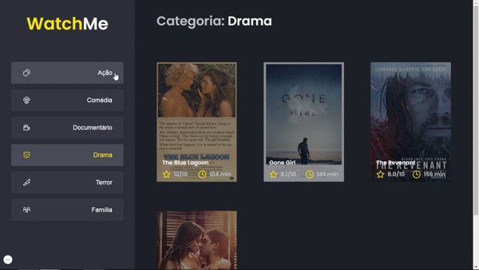

<p align="center">
  
</p>

<h1 align="center">WatchME</h1>

<h2 align="center">Descrição</h2><a name="descricao"></a>

<p align="center">
  Primeiro desafio complementar do Ignite, objetivo era fazer a componentização da SideBar e Content.
  A aplicação em si utiliza uma api fake e lista os filmes conforme o genero escolhido pelo usuário.
</p>


<p align="center">
 
 

</p>

<p align="center">
 <a href="#descricao">Descricão</a> •
 <a href="#tecnologias">Tecnologias</a> •
 <a href="#executando">Executando</a> • 
 <a href="#contribuicao">Contribuição</a> • 
 <a href="#licenca">Licença</a> • 
</p>

## 🛠️ Tecnologias<a name="tecnologias"></a>

Principais tecnologias utilizadas no desenvolvimento do projeto:

- [React](https://reactjs.org)
- [TypeScript](https://www.typescriptlang.org/)
- [SASS](https://sass-lang.com/)


## 💻 Executando o WatchME<a name="executando"></a>

### Pré-requisitos

É necessário ter instalado na sua máquina para execução desse projeto:
- <a href="https://nodejs.org/en/"> NodeJS </a>;
- Gerenciador de pacotes Npm(já vem com o NodeJS) ou <a href="https://yarnpkg.com/getting-started/install"> Yarn </a>;
- <a href="https://pt-br.reactjs.org/"> React </a>;


### ♊ Clonando o Repositório<a name="descricao"></a>

```bash

$ git clone https://github.com/SilvioDiasJr/desafio-complementar01-trilha-reactjs.git

# entre na pasta do projeto

$ cd desafio-complementar01-trilha-reactjs

```

Instale as dependências

```bash

$ yarn install

# ou, caso use npm

$ npm install

```

Rode a aplicação

```bash

$ yarn dev

# ou, caso use npm

$ npm dev

```

Rode a api fake

```bash

$ yarn server

# ou, caso use npm

$ npm server

```

## ⚙️ Como contribuir<a name="contribuicao"></a>

- Faça um fork desse repositório;
- Crie uma branch com a sua feature: `git checkout -b minha-feature`;
- Faça commit das suas alterações: `git commit -m 'feat: Minha nova feature'`;
- Faça push para a sua branch: `git push origin minha-feature`.

---

## 📝 Licença<a name="licenca"></a>

Este projeto está sob licença [MIT](./LICENSE).

<p>Feito com 💙 por <a href="https://www.linkedin.com/in/silviodiasjr/">Silvio Dias</a></p>
